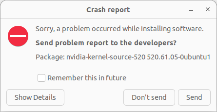
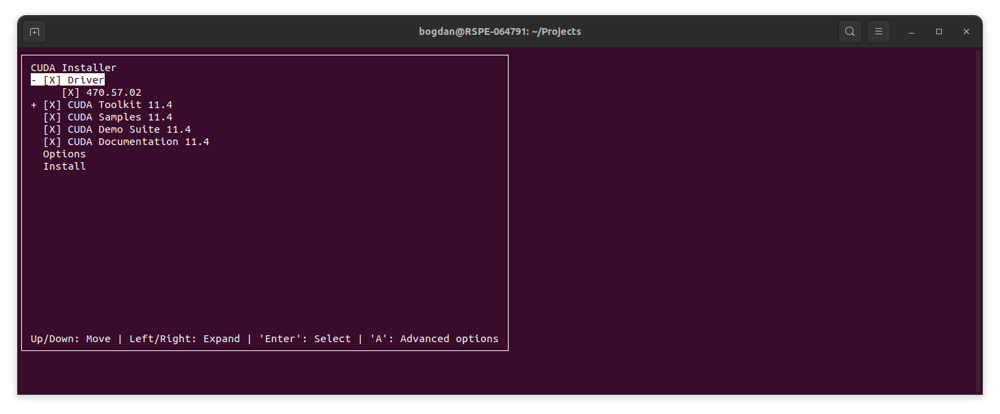

# cuda_sandbox
CUDA testing and installation manuals

# Installing CUDA v.11 on Ubuntu 22.04
The GeForce GTX TITAN Black "Compute Capability" 3.5 which makes it compatible with CUDA up to 11.8

According to [Nvidia's manual](https://developer.nvidia.com/cuda-11-8-0-download-archive?target_os=Linux&target_arch=x86_64&Distribution=Ubuntu&target_version=22.04&target_type=deb_local):

```
wget https://developer.download.nvidia.com/compute/cuda/repos/ubuntu2204/x86_64/cuda-ubuntu2204.pin
sudo mv cuda-ubuntu2204.pin /etc/apt/preferences.d/cuda-repository-pin-600
wget https://developer.download.nvidia.com/compute/cuda/11.8.0/local_installers/cuda-repo-ubuntu2204-11-8-local_11.8.0-520.61.05-1_amd64.deb
sudo dpkg -i cuda-repo-ubuntu2204-11-8-local_11.8.0-520.61.05-1_amd64.deb
sudo cp /var/cuda-repo-ubuntu2204-11-8-local/cuda-*-keyring.gpg /usr/share/keyrings/
sudo apt-get update
sudo apt-get -y install cuda
```
`cuda-repo-ubuntu2204-11-8-local` is a ...

installed cuda is ...

sudo cp /var/cuda-repo-ubuntu2204-11-8-local/cuda-D95DBBE2-keyring.gpg /usr/share/keyrings/


```
The following additional packages will be installed:
  cpp-12 cuda-11-8 cuda-cccl-11-8 cuda-command-line-tools-11-8 cuda-compiler-11-8 cuda-cudart-11-8 cuda-cudart-dev-11-8 cuda-cuobjdump-11-8 cuda-cupti-11-8
  cuda-cupti-dev-11-8 cuda-cuxxfilt-11-8 cuda-demo-suite-11-8 cuda-documentation-11-8 cuda-driver-dev-11-8 cuda-drivers cuda-drivers-520 cuda-gdb-11-8
  cuda-libraries-11-8 cuda-libraries-dev-11-8 cuda-memcheck-11-8 cuda-nsight-11-8 cuda-nsight-compute-11-8 cuda-nsight-systems-11-8 cuda-nvcc-11-8
  cuda-nvdisasm-11-8 cuda-nvml-dev-11-8 cuda-nvprof-11-8 cuda-nvprune-11-8 cuda-nvrtc-11-8 cuda-nvrtc-dev-11-8 cuda-nvtx-11-8 cuda-nvvp-11-8
  cuda-profiler-api-11-8 cuda-runtime-11-8 cuda-sanitizer-11-8 cuda-toolkit-11-8 cuda-toolkit-11-8-config-common cuda-toolkit-11-config-common
  cuda-toolkit-config-common cuda-tools-11-8 cuda-visual-tools-11-8 dctrl-tools dkms gcc-12 gcc-12-base:i386 gds-tools-11-8 krb5-locales libasan8
  libatomic1:i386 libbsd0:i386 libc6:i386 libcom-err2:i386 libcrypt1:i386 libcublas-11-8 libcublas-dev-11-8 libcufft-11-8 libcufft-dev-11-8 libcufile-11-8
  libcufile-dev-11-8 libcurand-11-8 libcurand-dev-11-8 libcusolver-11-8 libcusolver-dev-11-8 libcusparse-11-8 libcusparse-dev-11-8 libdrm-amdgpu1:i386
  libdrm-intel1:i386 libdrm-nouveau2:i386 libdrm-radeon1:i386 libdrm2:i386 libedit2:i386 libegl-mesa0:i386 libegl1:i386 libelf1:i386 libexpat1:i386 libffi8:i386
  libgbm1:i386 libgcc-12-dev libgcc-s1:i386 libgl1:i386 libgl1-mesa-dri:i386 libglapi-mesa:i386 libgles2:i386 libglvnd0:i386 libglx-mesa0:i386 libglx0:i386
  libgssapi-krb5-2:i386 libicu70:i386 libidn2-0:i386 libk5crypto3:i386 libkeyutils1:i386 libkrb5-3:i386 libkrb5support0:i386 libllvm15:i386 liblzma5:i386
  libmd0:i386 libnpp-11-8 libnpp-dev-11-8 libnsl2:i386 libnss-nis:i386 libnss-nisplus:i386 libnvidia-cfg1-520 libnvidia-common-520 libnvidia-compute-520
  libnvidia-compute-520:i386 libnvidia-decode-520 libnvidia-decode-520:i386 libnvidia-encode-520 libnvidia-encode-520:i386 libnvidia-extra-520
  libnvidia-fbc1-520 libnvidia-fbc1-520:i386 libnvidia-gl-520 libnvidia-gl-520:i386 libnvjpeg-11-8 libnvjpeg-dev-11-8 libopengl0:i386 libpciaccess0:i386
  libsensors5:i386 libssl3:i386 libstdc++6:i386 libtinfo5 libtinfo6:i386 libtirpc3:i386 libtsan2 libunistring2:i386 libwayland-client0:i386
  libwayland-server0:i386 libx11-6:i386 libx11-xcb1:i386 libxau6:i386 libxcb-dri2-0:i386 libxcb-dri3-0:i386 libxcb-glx0:i386 libxcb-present0:i386
  libxcb-randr0:i386 libxcb-shm0:i386 libxcb-sync1:i386 libxcb-xfixes0:i386 libxcb1:i386 libxdmcp6:i386 libxext6:i386 libxfixes3:i386 libxml2:i386
  libxshmfence1:i386 libxxf86vm1:i386 libzstd1:i386 nsight-compute-2022.3.0 nsight-systems-2022.4.2 nvidia-compute-utils-520 nvidia-dkms-520 nvidia-driver-520
  nvidia-kernel-common-520 nvidia-kernel-source-520 nvidia-modprobe nvidia-prime nvidia-settings nvidia-utils-520 screen-resolution-extra
  xserver-xorg-video-nvidia-520 zlib1g:i386
```

The process, however, finishes with an error
```
Errors were encountered while processing:
 nvidia-dkms-520
 cuda-drivers-520
 cuda-drivers
 nvidia-driver-520
 cuda-runtime-11-8
 cuda-11-8
 cuda-demo-suite-11-8
 cuda
E: Sub-process /usr/bin/dpkg returned an error code (1)
```


```
The solution is:

sudo apt install cuda-11-8 cuda-drivers=520.61.05-1

But cuda-runtime-11-8 has the wrong dependency

apt show cuda-runtime-11-8

Package: cuda-runtime-11-8
Version: 11.8.0-1
Priority: optional
Section: multiverse/devel
Maintainer: cudatools <cudatools@nvidia.com>
Installed-Size: 7,168 B
Depends: cuda-libraries-11-8 (>= 11.8.0), cuda-drivers (>= 520.61.05)
Download-Size: 2,424 B
APT-Sources: https://developer.download.nvidia.com/compute/cuda/repos/ubuntu2004/x86_64  Packages
Description: CUDA Runtime 11.8 meta-package
 Meta-package containing all runtime library packages and the CUDA driver.
 Locked at CUDA Toolkit version 11.8.

I think that is also the case for all other CUDA 11 packages.
```


## Make sure you have nvidia driver installed?


Ended up installing Nvidia driver through Ubuntu's software update

```
cat /proc/driver/nvidia/version
```


`NVIDIA-SMI 470.239.06   Driver Version: 470.239.06   CUDA Version: 11.4`

```
NVRM version: NVIDIA UNIX x86_64 Kernel Module  **470.239.06**  Sat Feb  3 06:03:07 UTC 2024
GCC version:  gcc version 12.3.0 (Ubuntu 12.3.0-1ubuntu1~22.04) 
```

Now I am getting `Failed to initialize NVML: Driver/library version mismatch` on `nvidia-smi`

Started to get crash reports, on closer inspection here is the one:




# Solution
The solution requires installing version 470 of each package. This will also require MOK update.
```
sudo apt install libnvidia-common-470 libnvidia-gl-470 nvidia-driver-470 -y
```

After this `nvidia-smi` works as expected again, just like after the installation of the driver through Ubuntu's update service.


## Installing CUDA-11.8
`sudo apt install cuda-11-8 -y`

This now effectively runs Nvidia's network installation as it seems that all my driver manipulations simply killed the cuda-repo-* installation from before.

## Same error again

```
Errors were encountered while processing:
 nvidia-dkms-520
 cuda-drivers-520
 cuda-drivers
 nvidia-driver-520
 cuda-runtime-11-8
 cuda-11-8
 cuda-demo-suite-11-8
 ```

 and nvidia-smi no longer works.

 seems that calling `sudo apt install cuda-11-8` overrides the driver to 520 version which means that doesn't work.

 ## Checking nvidia-smi
 ```
 +-----------------------------------------------------------------------------+
| NVIDIA-SMI 470.239.06   Driver Version: 470.239.06   CUDA Version: 11.4     |
|-------------------------------+----------------------+----------------------+
| GPU  Name        Persistence-M| Bus-Id        Disp.A | Volatile Uncorr. ECC |
| Fan  Temp  Perf  Pwr:Usage/Cap|         Memory-Usage | GPU-Util  Compute M. |
|                               |                      |               MIG M. |
|===============================+======================+======================|
|   0  NVIDIA GeForce ...  Off  | 00000000:02:00.0  On |                  N/A |
| 27%   43C    P8    17W / 250W |    437MiB /  6074MiB |      0%      Default |
|                               |                      |                  N/A |
+-------------------------------+----------------------+----------------------+
                                                                               
+-----------------------------------------------------------------------------+
| Processes:                                                                  |
|  GPU   GI   CI        PID   Type   Process name                  GPU Memory |
|        ID   ID                                                   Usage      |
|=============================================================================|
|    0   N/A  N/A      2122      G   /usr/lib/xorg/Xorg                114MiB |
|    0   N/A  N/A      2298      G   /usr/bin/gnome-shell               87MiB |
|    0   N/A  N/A      2864      G   ...1/usr/lib/firefox/firefox      137MiB |
|    0   N/A  N/A      4774      G   ...RendererForSitePerProcess       44MiB |
|    0   N/A  N/A     63708      G   ...veSuggestionsOnlyOnDemand       47MiB |
+-----------------------------------------------------------------------------+
```

The CUDA version in the top right corner suggests that the latest supported version of CUDA is 11.4 for driver 470.x. This might be the issue. So let's reinstall from the very begninng


# Important to kill cuda applications

`sudo apt purge cuda-*`

`sudo apt purge *nvidia*`

This was the only way to get rid of the annoying `previous installation detected` warning




# Unselect the driver installation from 11.4 bundle and stay on 470.239

```
===========
= Summary =
===========

Driver:   Not Selected
Toolkit:  Installed in /usr/local/cuda-11.4/
Samples:  Installed in /home/bogdan/, but missing recommended libraries

Please make sure that
 -   PATH includes /usr/local/cuda-11.4/bin
 -   LD_LIBRARY_PATH includes /usr/local/cuda-11.4/lib64, or, add /usr/local/cuda-11.4/lib64 to /etc/ld.so.conf and run ldconfig as root

To uninstall the CUDA Toolkit, run cuda-uninstaller in /usr/local/cuda-11.4/bin
***WARNING: Incomplete installation! This installation did not install the CUDA Driver. A driver of version at least 470.00 is required for CUDA 11.4 functionality to work.
To install the driver using this installer, run the following command, replacing <CudaInstaller> with the name of this run file:
    sudo <CudaInstaller>.run --silent --driver

Logfile is /var/log/cuda-installer.log
```